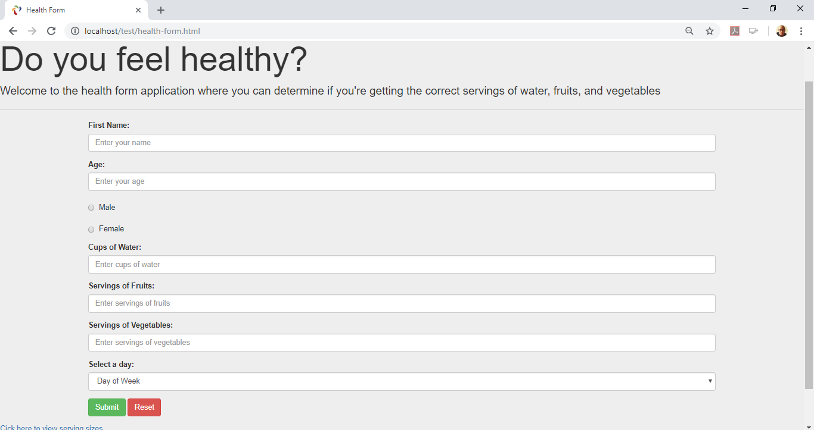
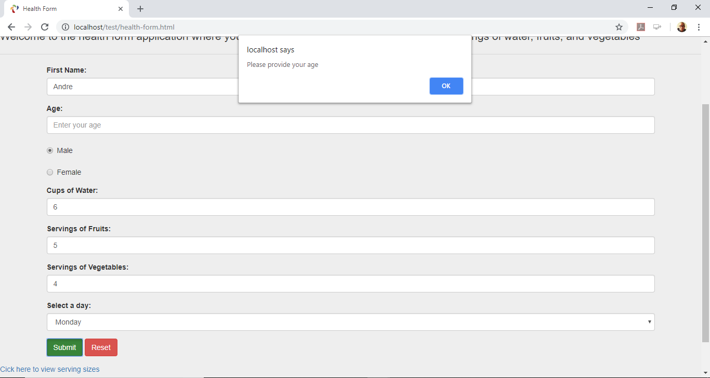
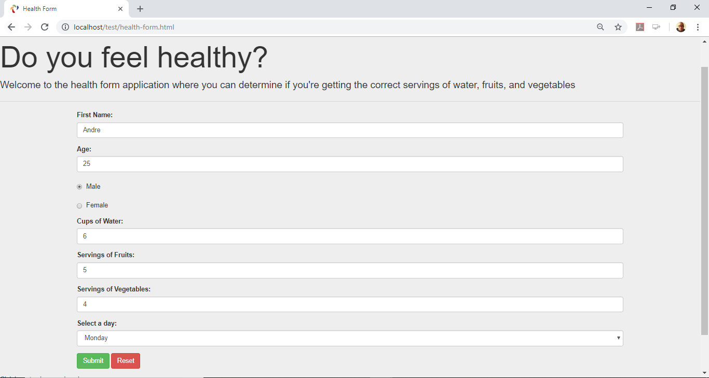
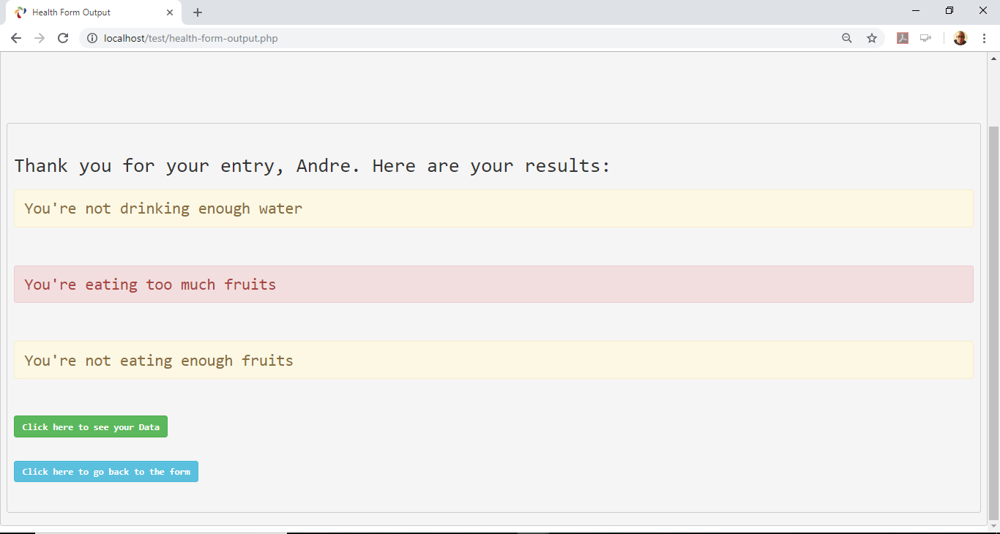
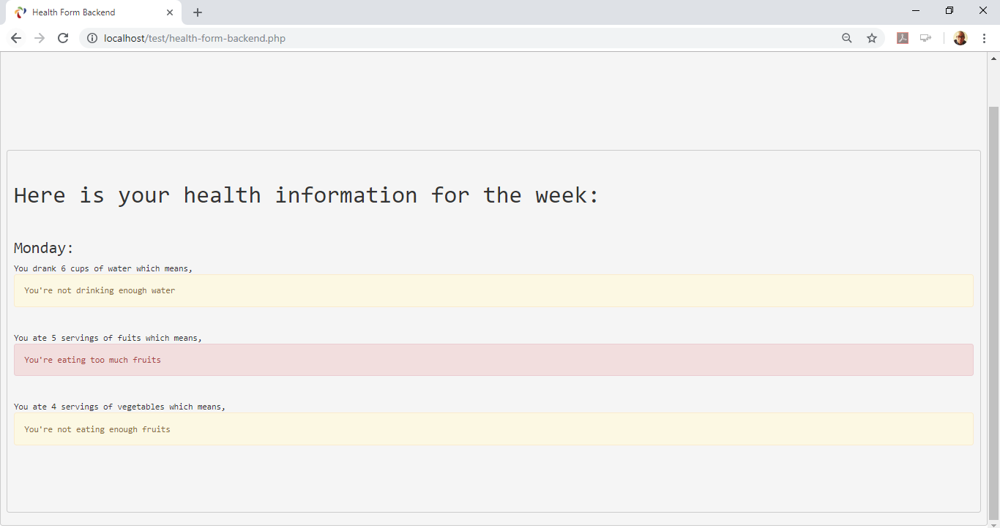

## Project Name:  Do you Feel Healthy?

### Date of Completion:  
7/31/18

### Developer Name:  
Andre Weir

### Project Description:
The project is designed to help users determine if they are drinking enough water and eating enough fruits and vegetables daily. The user is prompted to enter the number of cups of water he or she drank that day, and the number of servings of fruits and vegetables. Using the user’s age and sex, the application determines if the user had the right number of cups and servings, did not have enough, or had too much. In addition, the user can see their history of servings for that week to see how if they improved or decline in their healthy water intake. The form uses data validation for user input. Currently the project uses five different files:
1.	An HTML page for the user interface
2.	A PHP file call ‘class’ to store classes and the functions the program will use
3.	A PHP file to display the output of the user’s answers
4.	A Javascript file for user input validation
5.	A text file to store the user’s input
6.	A php file to output the stored data from the text file.

### Future Improvements:
In the future, I am hoping to expand the program to utilize more attributes like body weight and activity levels to better determine the amount of water the user should drink daily and the correct servings of fruits and vegetables.

### Screenshots of running application

##### Application Home page:

##### User validation checking user's input

##### Form completed with all the correct input

##### Displays the user's input and shows the user if they are getting the correct servings

##### Displays the user's last few entries
